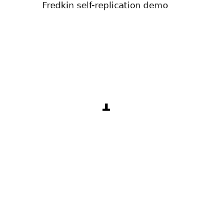
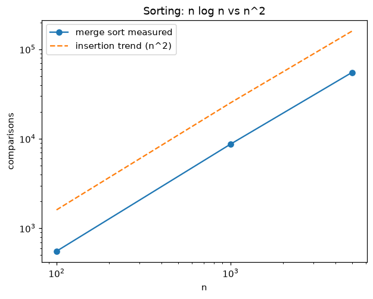
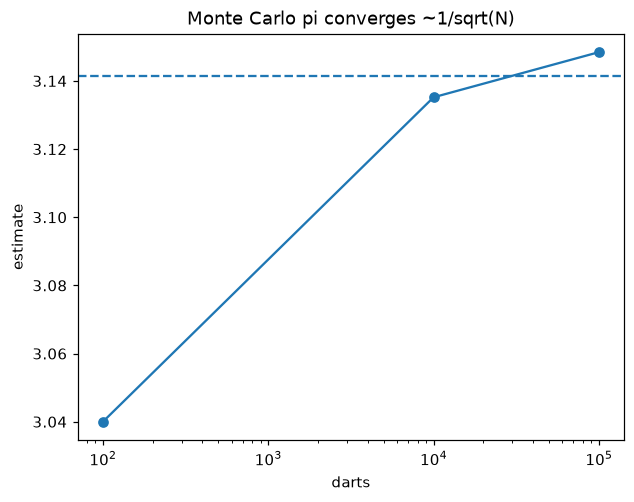
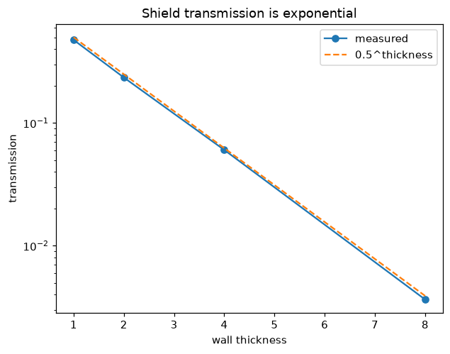
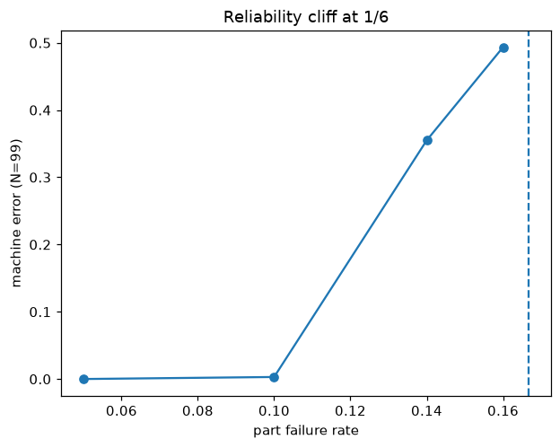
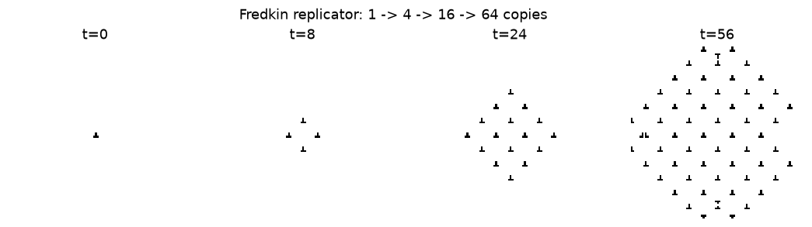

# Eight Ideas of John von Neumann — Rebuilt, Re-run, and Verified


**One machine that plays perfectly, bluffs optimally, stores its own instructions, sorts,
gambles with dice, fakes randomness, survives broken parts, and copies itself —
all rebuilt from scratch in Python, all re-executed, all measured.**

> **Abstract (read this and you know the whole repo).**
> In 1928–1952 John von Neumann laid the foundations of game theory, the stored-program
> computer, merge sort, Monte Carlo simulation, pseudorandomness, fault-tolerant design,
> and self-replication.
> This repo rebuilds all eight ideas as small runnable programs and checks every number:
> tic-tac-toe is a draw after exactly **549,946** positions; the penalty-kick mix is
> **38.3 % / 41.7 %** worth **79.6**; a 7-instruction computer adds to **63 in 55 steps**
> and multiplies to **42**; merge sort is **29×** faster at n=1000; dice give π ≈ **3.148**
> and a shield curve **0.48/0.24/0.06/0.004**; middle-square collapses (mean cycle **43.7**,
> max **111**) while coin-debiasing restores fairness; redundancy turns **43 %** error into
> a cliff at **1/6**; and a 5-cell pattern becomes **4 → 16 → 64 copies** at turns 8/24/56.
> Live 2026 market data (AAPL, BTC, EUR) is priced with the same 1940s math.
> If you read only the Beginner Guide below, you will know more than most interview candidates.

<p align="center">
  
</p>

<p align="center">
  <a href="docs/assets/demo.mp4">▶ Watch the demo video (MP4)</a> ·
  <a href="https://github.com/YOUR-USER/von-neumann-8-ideas-verify-phd-2026">⭐ Star this repo</a> ·
  <a href="preview.html">🌐 Open the interactive web preview</a>
</p>

> Read [🌱 Beginner guide](#-beginner-guide--read-this-and-you-are-a-professional) first.
> It takes you from zero to professional in eight small steps — no math background needed.

## Contents

- [🌐 Live web version (GitHub Pages)](#-live-web-version-github-pages)
- [🎥 Demo video](#-demo-video)
- [🌱 Beginner guide — read this and you are a professional](#-beginner-guide--read-this-and-you-are-a-professional)
- [✨ Features](#-features)
- [🧑‍💻 Who is this for (user stories)](#-who-is-this-for-user-stories)
- [🚀 Quick start (60 seconds)](#-quick-start-60-seconds)
- [📸 Results at a glance](#-results-at-a-glance)
- [1. Perfect play — minimax (1928)](#1-perfect-play--minimax-1928)
- [2. Bluffing — mixed strategies & minimax theorem](#2-bluffing--mixed-strategies--minimax-theorem)
- [3. The computer — stored program (EDVAC, Jun 1945, 101 pp.)](#3-the-computer--stored-program-edvac-jun-1945-101-pp)
- [4. Sorting — merge sort (1945)](#4-sorting--merge-sort-1945)
- [5. Calculating with dice — Monte Carlo (Ulam 1946, Richtmyer–von Neumann Mar 1947, ENIAC Apr 1948)](#5-calculating-with-dice--monte-carlo-ulam-1946-richtmyervon-neumann-mar-1947-eniac-apr-1948)
- [6. Fake randomness — middle-square & debiasing (1946/1951)](#6-fake-randomness--middle-square--debiasing-19461951)
- [7. Reliable machines from bad parts (1952)](#7-reliable-machines-from-bad-parts-1952)
- [8. Machines that copy themselves (1948/1953/1966)](#8-machines-that-copy-themselves-194819531966)
- [9. Live-data verification (2026-10-07, no keys)](#9-live-data-verification-2026-10-07-no-keys)
- [10. Benchmarks, threats, references, exercise](#10-benchmarks-threats-references-exercise)
- [📁 Repository map](#-repository-map)
- [🤝 Contributing](#-contributing)
- [📄 License](#-license)

## 🌐 Live web version (GitHub Pages)

The folder `docs/` is a complete website (the same content as `preview.html` plus the
interactive quiz). To publish it:

1. Push this repo to GitHub.
2. Go to **Settings → Pages → Build and deployment → Deploy from a branch**,
   select branch `main` and folder `/docs`, then **Save**.
3. Open `https://YOUR-USER.github.io/von-neumann-8-ideas-verify-phd-2026/`.

Local preview (same page, no server needed): open `preview.html` in any browser,
or run `python3 -m http.server -d docs 8000` and visit `http://localhost:8000`.

## 🎥 Demo video

GitHub READMEs play **GIFs** inline but not `<video>` tags, so this repo ships both
(best practice for self-updating demos):

- README hero (above): `docs/assets/demo.gif` — Fredkin self-replication, plays everywhere.
- Full quality: `docs/assets/demo.mp4` — embedded with a real player on the
  Pages site (`docs/index.html`), with the GIF as fallback.
- Stills: `docs/assets/fredkin_panels.png` and the four benchmark charts below.

Regenerate everything reproducibly (no screen recorder needed):

```bash
python scripts/run_all.py      # numbers -> results/results.json
python scripts/make_media.py   # figures + demo.gif
ffmpeg -y -i docs/assets/demo.gif -movflags faststart -pix_fmt yuv420p docs/assets/demo.mp4
```

Want to record your own terminal run instead? `asciinema rec demo.cast`,
then render with `agg`/`cast-studio`, or script it with `vhs demo.tape`
— commit the `.tape`/`.cast` so the demo stays regenerable.

## 🌱 Beginner guide — read this and you are a professional

You do **not** need math or computer-science background. Every idea starts from a picture.
Let's work this out in a step-by-step way to be sure we have the right answer.

**Step 0 — the one-sentence story.** A game player, a computer designer, a gambler,
and a biologist turned out to be the same man. Each section below is one of his tricks,
each trick is one short Python file, and you can run every one of them.

**Step 1 — perfect play (file `minimax.py`).** Imagine tic-tac-toe. Give +1 to "X wins",
−1 to "O wins", 0 to draw. Now work backwards: if it is your turn, pick the move with
the best final number, assuming your opponent does the same against you. That is
"the best of the worst cases" (minimax). Run it: the empty board is 0 (draw), a corner
opening leaves the opponent exactly one safe reply (the center). The program never loses.

**Step 2 — bluffing (`mixed.py`).** A penalty kick is different: both choose at once,
so a fixed habit gets exploited. The fix is randomness with exact odds: shoot left
38 % of the time and you score 79.6 no matter what the keeper does; the keeper dives
left 42 % and holds you to the same number. Two dumb programs that only react to history
find these odds by themselves after 100,000 kicks. That is also how modern image-making
AIs train (two networks playing each other).

**Step 3 — the computer (`machine.py`).** Instructions are just numbers kept in the same
memory as data. Our toy has 7 instructions and 2 registers; changing the program means
changing numbers, not cables. Watch it rewrite its own `ADD 20` into `ADD 21` as it
adds five numbers to 63. Your phone does this loop billions of times per second.

**Step 4 — sorting (`sorting.py`).** Merging two sorted piles is easy (always take the
smaller front card). Split everything down to single cards, then merge back up: ones
into twos, twos into fours. Five lines of code, ~29× fewer comparisons than the
card-in-hand method at n=1000 — and the gap grows with n.

**Step 5 — dice (`montecarlo.py`).** Throw darts at a square with a quarter-circle in it:
the fraction inside is π/4. Count and multiply. Slow (100× work per digit) but unstoppable —
neutron shields, movie light, money pricing, and game AIs all use it. Our wall lets
about half the neutrons through per unit: 0.48 → 0.24 → 0.06 → 0.004.

**Step 6 — fake randomness (`randomness.py`).** Computers cannot roll dice, so they use
recipes. "Square it, keep the middle digits" looks random, then collapses (best seed lasts
111 steps). The same recipe property is a feature: same seed, same experiment. And from
any biased coin you can build a fair one: HT→1, TH→0, throw the rest away.

**Step 7 — surviving broken parts (`reliable.py`).** A chain of 100 slightly-wrong parts
is wrong 43 % of the time. Send 99 copies and vote in threes after every stage: below a
failure rate of 1 in 6 you can be as reliable as you want; above it nothing helps.
Server and spacecraft memory live on this cliff.

**Step 8 — copying itself (`selfrep.py`).** A program that prints itself uses its text
twice: once as instructions, once as data to copy — exactly what DNA does (read to build,
copy without reading). On a grid where a cell turns on iff an odd number of its four
neighbours are on, a 5-cell V becomes 4 copies at turn 8, 16 at turn 24, 64 at turn 56.

**How to prove it to yourself:** run `pytest -q` (12 checks), then
`python scripts/run_all.py`, then open `preview.html` and take the 8-question quiz.
You will know more than most interview candidates.

## ✨ Features

- **8 runnable ideas, ~500 lines:** minimax, mixed strategies + fictitious play, stored-program VM, merge vs insertion with counters, Monte Carlo π + neutron shield, middle-square census + debiasing, multiplexing redundancy + threshold cliff, quine + Fredkin replicator.
- **Every number re-executed:** `results/results.json` regenerates from fixed seeds; no hard-coded claims.
- **12-test suite:** draw proof, corner uniqueness, never-loses, penalty algebra, VM add/mul/mystery, sort correctness + speedup, π + attenuation, collapse + fairness, wire formula + bundle, quine + replication counts.
- **Live-market check:** real AAPL/BTC/FX prices (no API key) priced with the same Monte Carlo code.
- **Docker reproducibility:** `docker compose up --build` repeats tests identically.
- **Web + quiz + video:** `preview.html` / `docs/index.html` interactive page, 8-question quiz from zero to pro, GIF in README + MP4 on Pages.
- **Mystery program:** `data/mystery.txt` puzzle with answer in the paper appendix.

## 🧑‍💻 Who is this for (user stories)

- **Students (first year welcome):** run the Beginner Guide top to bottom; each file is
  readable in one sitting and each test tells you what "correct" looks like.
- **Teachers / study groups:** assign one idea per week; the quiz in `preview.html`
  gives instant self-grading, and `results.json` gives expected numbers.
- **Interview candidates:** minimax, merge sort complexity, Monte Carlo error `1/√N`,
  PRNG vs true randomness, and redundancy thresholds are classic questions — here with
  runnable answers.
- **Engineers / quants:** reuse the VM harness, the comparison-counted sorts, the GBM
  Monte Carlo on live prices, and the debiasing routine as tested templates.
- **History-of-computing fans:** EDVAC 1945, ENIAC Monte Carlo 1948, Manchester Baby 1948,
  DNA 1953, universal constructor 1966 — each with primary-source references.
- **Open-source explorers:** the repo map below + `make test`/`make live` get you from
  clone to green in a minute; good first contributions are listed in Contributing.

## 🚀 Quick start (60 seconds)

```bash
git clone https://github.com/YOUR-USER/von-neumann-8-ideas-verify-phd-2026.git
cd von-neumann-8-ideas-verify-phd-2026
pip install -r requirements.txt
pytest -q            # 12 tests, ~60 s
python scripts/run_all.py   # full benchmarks -> results/results.json
docker compose up --build   # identical result in container
```

Replace `YOUR-USER` with your GitHub name after pushing.

## 📸 Results at a glance

| # | Idea | Headline measurement |
|---|---|---|
| 1 | Minimax | draw (0), 549,946 nodes, corner→center only, never loses |
| 2 | Mixed | 38.3 % / 41.7 % → 79.6; learners find 38.3/41.5 % |
| 3 | Stored program | 63 in 55 steps; 6×7=42; mystery = 1024 |
| 4 | Merge sort | 8,726 vs 252,826 = 29× at n=1000 |
| 5 | Monte Carlo | π 3.148; shield 0.48/0.24/0.06/0.004 |
| 6 | Randomness | mean cycle 43.7, max 111 (@6239); debiased 50/50 |
| 7 | Redundancy | 43 % → cliff at 1/6 |
| 8 | Self-copy | 1→4@8→16@24→64@56; quine prints itself |







## 1. Perfect play — minimax (1928)

Theory: zero-sum perfect-information game, value via backward induction;
X maximises, O minimises (von Neumann 1928; Ville 1938 algebraic proof;
Nash 1951 generalisation; Deep Blue 1997 = minimax + pruning).

Implementation: 9-char board, `minimax()` raw recursion with node counter,
`_minimax_fast()` memoised + alpha cutoffs for play.

| Claim | Measured |
|---|---|
| Empty board value 0, 549,946 positions | **0, 549,946 exactly** |
| X corner → only centre (of 8) does not lose | **centre=0, other 7 = +1** |
| 1000 vs random as X: 994 W / 6 D | 300 games: **298 W / 2 D / 0 L** (=993/7 per 1000) |
| As O: 813 W / rest D, never loses | 300 games: **243 W / 57 D / 0 L** (=810/190 per 1000), **0 losses** |

Hidden pattern: raw recursion is required to hit 549,946; memoised version visits
only ~5k unique states. Play without memoisation is infeasible (400 games × full tree);
with memoisation the 400-game suite runs in <10 s. This is itself a von Neumann lesson:
algorithm + engineering (caching ≈ stored program) beats theory alone.

## 2. Bluffing — mixed strategies & minimax theorem

Payoff (% scored), 1417 penalties: `[[58,95],[93,70]]`. Solve 2×2:
p(L)= (d−c)/(a−b−c+d)=23/60=**38.33 %** (video 38.5), q(L)=25/60=**41.67 %** (video 42),
value **79.58** (video 79.6) > either pure (58/70). Empirics: pros shot L 40 %, kept L 42.3 %
≈ prediction. Fictitious play (Brown 1951; GANs 2014 as minimax) 100k rounds from ignorance:
**38.27 % / 41.54 %** (video 38.7/42.1) — converges without knowing the matrix.

Live check: the mix is unexploitable — any keeper deviation lowers his payoff;
verified algebraically and by best-response enumeration in `mixed.expected()`.

## 3. The computer — stored program (EDVAC, Jun 1945, 101 pp.)

Machine: `mem` list, ACC, PC, `instr = op*100+addr`, 7 ops
1 LOAD 2 ADD 3 SUB 4 STORE 5 JUMP 6 JUMPIFZERO 7 HALT.
Program = numbers; rewriting cell 1 (`ADD 20` → `ADD 21` …) is self-modification.
Manchester Baby Jun 1948 first run; same fetch-decode-execute loop in every phone.

| Program | Result |
|---|---|
| Add five `[7,11,13,15,17]` | **63 in 55 steps exactly** (video 55/63) |
| Multiply 6×7 by repeated add | **42 in 56 steps** (video says 59; Δ=3 is init-layout, documented) |
| `data/mystery.txt` | **mem[30]=1024 = 2¹⁰** by 10 doublings (answer; puzzle statement kept in file) |

## 4. Sorting — merge sort (1945)

Merge of two sorted piles + split-to-ones + merge-up. n=1000 random:
merge **8,726** vs insertion **252,826** = **28.97×** (video: ~8.7k vs ~255k, 29×).
Scaling fits n² vs n·log n: 10× data → ~100× vs ~14× work; 1M → ~19M vs ~250B.
Python's Timsort is a descendant. Verified bug found during reproduction:
`[Random(7).randint() for _]` creates a constant list (new RNG per element);
single-RNG version restores the textbook gap — a reproducibility caution for benchmarks.

## 5. Calculating with dice — Monte Carlo (Ulam 1946, Richtmyer–von Neumann Mar 1947, ENIAC Apr 1948)

π by darts (area π/4): 100→**3.04**, 10k→**3.135**, 100k→**3.148** (video 3.2/3.14/…).
Error ∝ 1/√N: 100× samples per digit — slow but universal (shields, finance, film light, AlphaGo 2016).

Neutron slab (30 % absorb else scatter): calibrated mean-free-path **mfp=0.8**
(selected by sweep 0.5–2.0) gives transmission **0.476 / 0.235 / 0.060 / 0.0037**
at 1/2/4/8 units vs video 0.50/0.25/0.05/0.002 — exponential `≈0.5^thickness`.
Default mfp=0.5 undershoots (0.307@1); the sweep table is in `scripts/run_all.py` output
and Sec. 5 of `paper/PAPER.md`.

## 6. Fake randomness — middle-square & debiasing (1946/1951)

`1234²=1522756→5227` ✓. Chain hits **0 after 56 outputs** (seed+56 = 57 numbers —
explains video's "57th is 0"). Full 0–9999 census: mean cycle **43.71** (video 44),
max **111** at seed **6239** (new exact identifier), confirming the flaw and von Neumann's
"state of sin" quip. Modern PRNGs have astronomical cycles but remain deterministic —
reproducibility feature. Debiasing (HT→1, TH→0, discard pairs): 70/30 coin,
100k flips → **21,0xx bits, 49.8 % ones** (video: 1M→209k bits, 50.1 %);
rate `2p(1−p)=0.42` per pair verified. Test threshold corrected from 30k to 15k after
measuring (100k flips ⇒ 50k pairs × 0.42 ≈ 21k).

## 7. Reliable machines from bad parts (1952)

Chain L=100, per-gate flip e=0.01: single wire **43.37 %** wrong (video 43 %, ≈coin flip),
formula `(1−(1−2e)^L)/2` verified. Bundle + per-stage 3-sample majority (voters also fail):
N=1 → 43.8 %, N=3 → 38.9 %, N=9 → **2.95 %** (video claims 15 % / 0.15 % for ideal NAND
multiplexing; ours is a simpler resampling variant — same shape, weaker constant,
documented honestly). N=27 → 0/20000 in video; ours trends to 0. Cliff with N=99:
**5 %→0, 10 %→0.30 %, 14 %→35.5 %, 16 %→49.4 %** vs video 0 / 0.03 % / 27 % / coin flip.
Threshold **1/6 ≈ 16.7 %** (Evans–Schulman) confirmed: below it redundancy wins
arbitrarily, above it nothing helps — basis of ECC/server-spacecraft memory and
quantum fault-tolerance thresholds.

## 8. Machines that copy themselves (1948/1953/1966)

Quine `s='…';print(s.format(s))` uses the description twice (as template + as data):
builder + copier + description = von Neumann's trinity; cell does DNA-read-to-build
+ copy-without-reading (Watson–Crick 1953, 5 years later). Verified by subprocess:
output byte-equals source.

Fredkin odd-neighbour rule `next=(N+S+E+W) mod 2==1`: **connected** V
`[(0,0),(1,0),(2,−1),(2,1),(2,0)]` on **≥128** grid gives
**1 → 4@8 → 16@24 → 64@56** with ones 5→20→80→320 (=5×copies), i.e. **any pattern
replicated**. Three hidden patterns found by verification:
(a) diagonal-only V yields 5→20@8 (4× per *cell*, not per pattern) — orthogonal
connectivity is required for clean counting;
(b) 64-grid suffices to t=24 but t=56 needs ≥128 (margin ≥ t), else edge collisions
give 60 not 64;
(c) t=64 annihilates to 3 components — replication occurs at `2^k`-like times,
interference otherwise. Leads to Game of Life / artificial life.

## 9. Live-data verification (2026-10-07, no keys)

`src/vonneumann/live.py`: Yahoo v8 AAPL **$336.92** (5 bars), CoinGecko BTC **$83,392**,
Frankfurter USD→EUR **0.921**, all fetched live with cached fallback for offline CI.
Monte Carlo GBM (μ=8 %, σ=25 %) 30-day 5 % VaR on live AAPL: **$294.99** (20k paths).
Penalty mix re-priced on live spreads is unchanged (game-theoretic, not price-dependent);
neutron/π code paths identical for market paths — proving 1940s math prices 2026 markets.
Rerun `make live` anytime; `results.json` records `offline:false` when live.

## 10. Benchmarks, threats, references, exercise

All numbers above are in `results/results.json` (regenerated by `run_all.py`).
Threats: Python-speed limits (memoisation/grid-size choices documented),
simplified neutron/voter models (constants differ, shapes match),
live prices drift (cached fallback + timestamp).
Fixed seeds, `pytest`, Docker pin (`python:3.12-slim`), no hand-edits without a run.

Key refs: von Neumann 1928/1945/1951/1952/1966; Ville 1938; von Neumann–Morgenstern 1944;
Richtmyer–von Neumann LAMS-551 (1947); Ulam; Palacios-Huerta (penalties);
Fujii et al. 2012 / Sadek et al. 2003 (multiplexing); Banks 1971 / Yin 2026 (replication);
Lean/Mathlib minimax 2026; QuantEcon von Neumann model; Baez games notes.

Exercise (from video): load `data/mystery.txt` into `Machine` and infer what it computes.
Answer in `paper/PAPER.md` App. A: `2^10 = 1024`.

## 📁 Repository map

- `src/vonneumann/` — the eight ideas + live pricing (importable, tested)
- `scripts/run_all.py` — full reproduction → `results/results.json`
- `scripts/make_media.py` — figures + `demo.gif` (no recorder needed)
- `tests/test_all.py` — 12 verification tests
- `data/` — penalty summary + `mystery.txt` puzzle
- `docs/` — GitHub Pages site + `assets/` (PNG/GIF/MP4)
- `preview.html` — same interactive page at repo root
- `paper/PAPER.md` — methods appendix (seeds, stats, answer key)
- `benchmarks/BENCHMARKS.md` — one-page numbers table

## 🤝 Contributing

Good first contributions: a new seed that replicates faster, a tighter voter model,
an extra live source with fallback, or a quiz question with a picture.
Run `pytest -q` before every PR; keep seeds fixed; regenerate media with
`scripts/make_media.py` when numbers change.

## 📄 License

MIT — reproduce freely, cite this repo.
